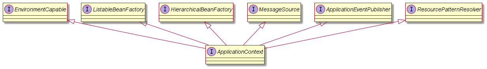
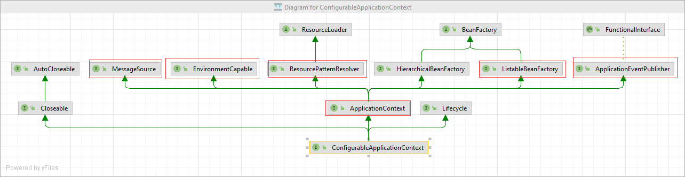

# spring 

## 1.BeanFactory接口和ApplicationContext接口
> application context的类图:

> ApplicationContext中组合了**BeanFactory**； 
> 而且还继承了这些接口，意味着它可以做以下事情：
> 1. BeanFactory的功能，BeanFactory才是spring的核心容器；
> 2. 国际化；
> 3. resource；
> 4. environment环境变量；
> 5. event publish；

### 1.1 BeanFactory接口
> BeanFactory接口中表面上只有**getBean**相关方法，但是**控制反转、依赖注入、bean的生命周期**等功能都是它的实现类提供。 

### 1.2 MessageSource接口
> 处理国际化，如果应用想要支持多语言，可以使用这个接口的功能。

> 下面是一个例子： 
> 在resources目录下准备messages开头的properties文件: 
> idea会把messages开头的properties文件识别到Resource Bundle 'messages'这个虚拟目录下，
> 但是实际上并不存在这个目录

> 各个文件中配置好key的翻译结果 

> messages_en.properties: 
> hi=hello

> messages_zh.properties: 
> hi=你好

> messages_ja.properties: 
> hi=こんにちは

> 通过applicationContext.getMessage来获取key的翻译结果：
> 
    System.out.println(applicationContext.getMessage("hi", null, Locale.CHINA));
    System.out.println(applicationContext.getMessage("hi", null, Locale.ENGLISH));
    System.out.println(applicationContext.getMessage("hi", null, Locale.JAPANESE));

    output:

    你好
    hello
    こんにちは

### 1.3 ResourcePatternResolver接口
> 根据通配符，匹配类路径或者磁盘中的某个路径的资源。 
> Resource是对当前应用中 文件的抽象。还包括引用的jar包中的资源

> 下面是一个例子： 
> 
    Resource resource = applicationContext.getResource("classpath:application.properties");
    System.out.println(resource);

    Resource[] resources = applicationContext.getResources("classpath*:META-INF/spring.factories");
    for (Resource resource1 : resources) {
        System.out.println(resource1);
    }

    output:

    class path resource [application.properties]
    URL [jar:file:/C:/Users/Administrator/.m2/repository/org/springframework/boot/spring-boot/2.7.17/spring-boot-2.7.17.jar!/META-INF/spring.factories]
    URL [jar:file:/C:/Users/Administrator/.m2/repository/org/springframework/boot/spring-boot-autoconfigure/2.7.17/spring-boot-autoconfigure-2.7.17.jar!/META-INF/spring.factories]
    URL [jar:file:/C:/Users/Administrator/.m2/repository/org/springframework/spring-beans/5.3.30/spring-beans-5.3.30.jar!/META-INF/spring.factories]

### 1.4 ApplicationEventPublisher接口
> spring中的事件发布器。 
> 这个功能只适用于单体应用，分布式应用还是mq

### 1.5 EnvironmentCapable接口
> 读取系统环境变量，读取配置文件中的键值。**(windows下 key不区分大小写, linux区分)**

> 下面是一个例子： 

    ConfigurableEnvironment environment = applicationContext.getEnvironment();
    System.out.println(environment.getProperty("JAVA_HOME"));
    System.out.println(environment.getProperty("java_home"));
    System.out.println(environment.getProperty("server.port"));

    output:

    C:\Program Files\Java\jdk1.8.0_271
    C:\Program Files\Java\jdk1.8.0_271
    8080
    

## 2.BeanFactory接口和ApplicationContext接口的常见实现类

### BeanFactory的实现

> 有下面一段代码 
> 一个配置类Config，里面配置了两个bean，其中bean1需要注入bean2；

    @Configuration
    static class Config {

        @Bean
        public Bean1 bean1() {
            return new Bean1();
        }

        @Bean
        public Bean2 bean2() {
            return new Bean2();
        }
    }

    static class Bean1 {
        private static final Logger log = LoggerFactory.getLogger(Bean1.class);
        public Bean1() {
            log.debug("构造Bean1()");
        }
        @Autowired
        private Bean2 bean2;
        public Bean2 getBean2() {
            return bean2;
        }
    }

    static class Bean2 {
        private static final Logger log = LoggerFactory.getLogger(Bean2.class);
        public Bean2() {
            log.debug("构造Bean2()");
        }
    }

> DefaultListableBeanFactory 是 beanFactory 最为重要的实现。 
> 接下来将用DefaultListableBeanFactory来演示.
> 1. 先创建DefaultListableBeanFactory的实例对象；
> 2. beanFactory创建好后，此时beanFactory中并无bean；
> 3. 向beanFactory中，添加配置类Config 的 beanDefinition信息，beanFactory会根据beanDefinition来创建bean对象；
> 4. 再打印beanFactory中的所有的bean的name；

    public static void main(String[] args) {

        DefaultListableBeanFactory beanFactory = new DefaultListableBeanFactory();
        AbstractBeanDefinition beanDefinition = BeanDefinitionBuilder.genericBeanDefinition(Config.class).setScope("singleton").getBeanDefinition();
        beanFactory.registerBeanDefinition("config", beanDefinition);

        String[] beanDefinitionNames = beanFactory.getBeanDefinitionNames();
        for (String beanDefinitionName : beanDefinitionNames) {
            System.out.println(beanDefinitionName);
        }
    }

> 根据以往初学的认知，配置类Config中加了@Bean注解，那么此时beanFactory中，应该有Config，Bean1，Bean2的实例，
> 但是运行这段代码，发现beanFactory中只有Config； 
> 这是因为 **@Bean注解没有被解析**，解析注解并不是BeanFactory的工作；  

> 修改上面的代码：添加： 
> AnnotationConfigUtils.registerAnnotationConfigProcessors(beanFactory); 
> 这行代码的作用是：向beanFactory中添加一些常用的 beanFactoryPostProcessor 后处理器，beanFactoryPostProcessor后处理器是对beanFactory的拓展 原始的beanFactory没有解析注解的能力，有了后处理器，就可以解析这些注解。
> beanPostProcessor，针对bean的生命周期的各个阶段提供扩展； 比如@Autowired @Resource；

    public static void main(String[] args) {

        DefaultListableBeanFactory beanFactory = new DefaultListableBeanFactory();
        AbstractBeanDefinition beanDefinition = BeanDefinitionBuilder.genericBeanDefinition(Config.class).setScope("singleton").getBeanDefinition();
        
        AnnotationConfigUtils.registerAnnotationConfigProcessors(beanFactory);

        beanFactory.registerBeanDefinition("config", beanDefinition);

        for (BeanFactoryPostProcessor beanFactoryPostProcessor : beanFactory.getBeansOfType(BeanFactoryPostProcessor.class).values()) {
            beanFactoryPostProcessor.postProcessBeanFactory(beanFactory);
        }

        for (BeanPostProcessor beanPostProcessor : beanFactory.getBeansOfType(BeanPostProcessor.class).values()) {
            beanFactory.addBeanPostProcessor(beanPostProcessor);
        }

        String[] beanDefinitionNames = beanFactory.getBeanDefinitionNames();
        for (String beanDefinitionName : beanDefinitionNames) {
            System.out.println(beanDefinitionName);
        }
    }

> beanfactory  
> 1.不会主动调用BeanFactory后处理器 
> 2.不会主动调用Bean后处理器 
> 3.不会主动初始化单例bean 
> 4.不会解析${}, #{}  
> 
> 而 ApplicationContext 就会做上面beanFactory不会做的事； 
> 因此在实际开发中，更加推荐使用ApplicationContext
> 

> 关于Bean后处理器的优先级（了解即可） 
> 
> 如果一个属性上，既有@Autowired，又有@Resource，谁会生效？ 
> 谁先加载，谁生效。
> 取决于 AutowiredAnnotationBeanPostProcessor 和 CommonAnnotationBeanPostProcessor的优先级
> 
>

### ApplicationContext的实现

> 参考TestApplicationImpl